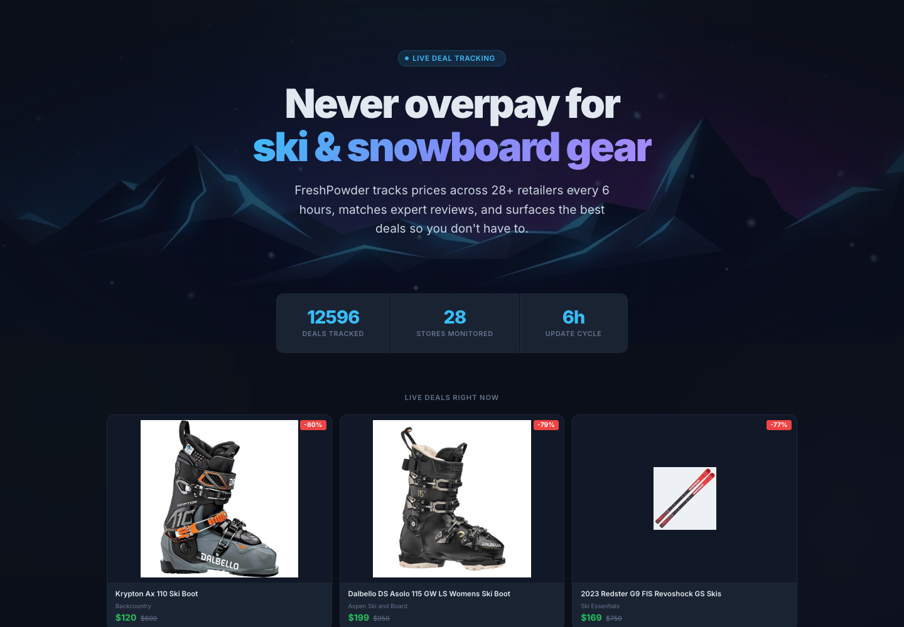
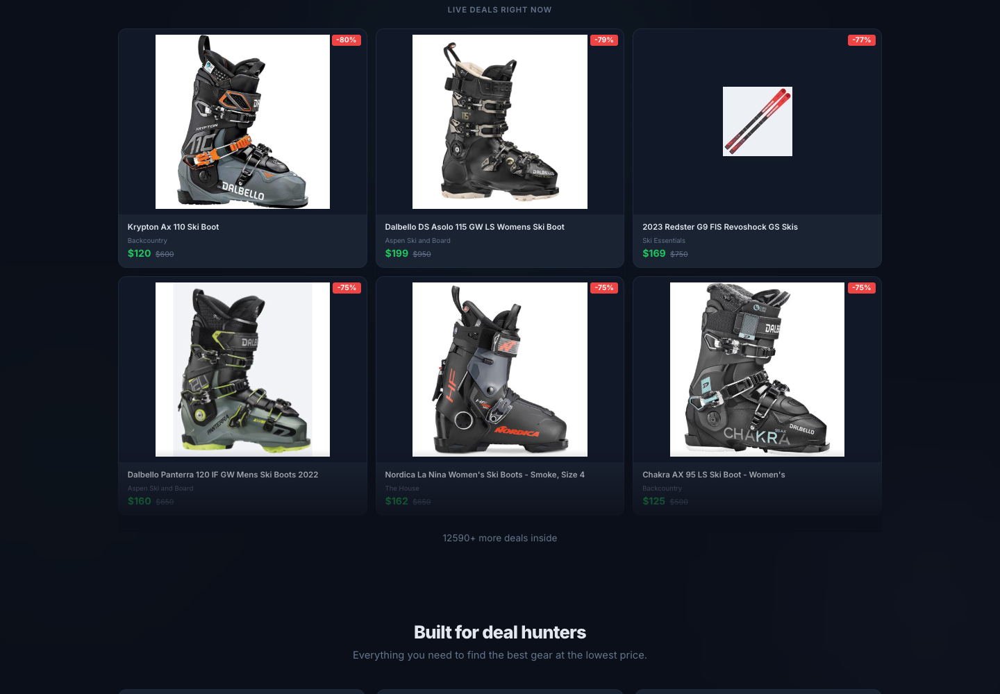

# FreshPowder

FreshPowder is an invite-gated ski and snowboard deal aggregator that tracks gear prices across 28+ North American retailers every 6 hours, matches expert review scores, and surfaces the best discounts in one fast, filterable web app.

If you have ever kept 12 retailer tabs open waiting for skis, boots, or boards to drop, this is the app I wanted instead: one live feed, real prices, deep filters, review context, and shareable deals.

**Live app:** https://snow-deals.onrender.com



## Why It Exists

Skiing and snowboarding gear is expensive, and the best deals are scattered across retailers with inconsistent search, stale sale pages, and noisy clearance sections. FreshPowder continuously scrapes major stores, normalizes the data, removes obvious false positives, and highlights the deals worth checking before they disappear.

## What FreshPowder Tracks

- **12k+ current and historical deals** from ski and snowboard retailers
- **28+ monitored stores**, including evo, Backcountry, REI, Steep & Cheap, The House, Ski Essentials, MEC, and more
- **6-hour refresh cadence** through GitHub Actions scraping
- **Expert review context** from OutdoorGearLab and The Good Ride where matches are available
- **Discount depth, store, category, brand, price, length, review, tax-free, and search filters**



## Product Highlights

- **Live deal feed** — See discounted skis, snowboards, boots, helmets, goggles, apparel, and accessories in one place.
- **Smart filtering** — Narrow by category, brand, retailer, discount, price, length, review status, tax-free stores, and keyword search.
- **Quick presets** — One-tap views like `Under $100`, `Top Reviewed`, `50%+ Off`, `Tax Free`, and `New Arrivals`.
- **Review matching** — Automatically attaches OutdoorGearLab and Good Ride scores when products can be matched confidently.
- **Shareable finds** — Copy or native-share individual deal links from mobile or desktop.
- **Invite-gated growth** — Human-readable invite codes keep early usage controlled while the scraper and categorizer mature.
- **Analytics-ready** — Server-side click/event tracking shows which categories, stores, and deals are actually useful.

## Architecture

FreshPowder is intentionally boring in the best way: server-rendered pages, fast SQLite reads, background scraping, and minimal frontend machinery.

| Layer | Stack |
| --- | --- |
| Web app | FastAPI, Jinja2, htmx, vanilla JavaScript, custom CSS |
| Deal data | SQLite generated by scheduled scrapes |
| Auth/events | Turso for invite codes, sessions, waitlist, and click events |
| Scraping | GitHub Actions cron, httpx, BeautifulSoup4/lxml, Playwright for JS-rendered sites |
| Reviews | OutdoorGearLab + The Good Ride matching pipeline |
| Deployment | Docker on Render |

## Repository Layout

```text
├── aggregator/              # Primary FreshPowder web app
│   ├── aggregator/
│   │   ├── config.py        # Store configs, categories, keywords, brands, model names
│   │   ├── categorizer.py   # Product categorization engine
│   │   ├── db.py            # SQLite deal queries
│   │   ├── auth_db.py       # Turso auth/session/event storage
│   │   ├── scraper.py       # Multi-store scrape orchestration
│   │   ├── reviews.py       # Expert review matching
│   │   ├── web/             # FastAPI routes, templates, static assets
│   │   └── parsers/         # Per-store scrapers
│   └── tests/
├── tampermonkey/            # Secondary browser userscript
├── snow_deals/              # Secondary Python CLI
├── docs/images/             # README screenshots
├── GTM.md                   # Go-to-market strategy
├── .github/workflows/       # Scheduled scrape workflow
└── Dockerfile
```

## Getting Started

### Prerequisites

- Python 3.12+
- pip

### Install

```bash
cd aggregator
pip install -e .
```

### Run Locally

```bash
export SECRET_KEY="your-secret"
export ADMIN_KEY="your-admin-key"

uvicorn aggregator.web.app:create_app --factory --reload
```

### Run Tests

```bash
python -m pytest aggregator/tests/ -x -q
```

### Admin CLI

```bash
# Run a manual scrape
python -m aggregator.cli scrape

# Generate invite codes
python -m aggregator.cli generate-codes --count 5

# Sync auth DB to Turso
python -m aggregator.cli sync-auth
```

## Notes For Contributors

FreshPowder is public, but production credentials and local data files are not. Do not commit `.env`, `cookies.json`, Turso tokens, auth databases, or scraped `.db` files.

Categorization quality matters more than raw deal count. When adding stores or parser rules, run the categorizer tests first and watch for false positives like fashion boots, underwear, accessories, or products whose names collide with ski/snowboard model names.

## License

MIT
